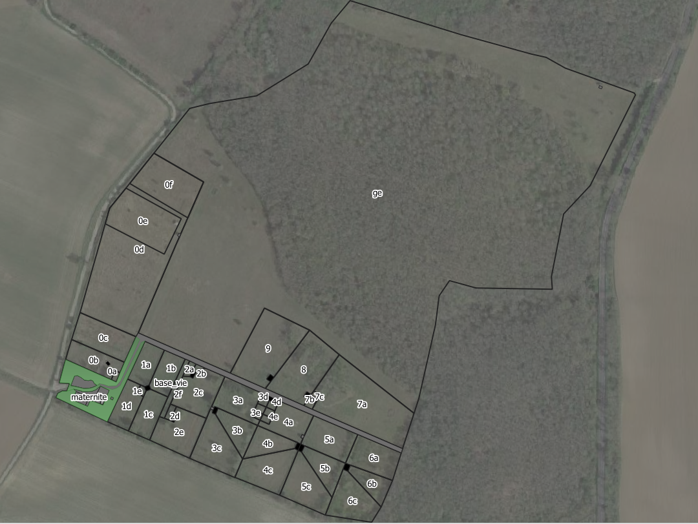
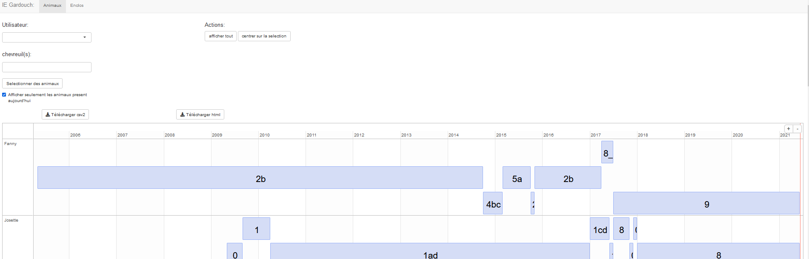

# Gardouch_suivi_enclos
Applicatif permettant la visualisation et la modification des mouvement d'animaux dans l'insatallation expérimentale de Gardouch

## Introduction

L'installation expérimentale (IE) du CEFS sur la commune de Gardouch a pour principal objectif de faciliter l’acquisition de données et d'expérimenter sur le système chevreuil-environnement. Cet objectif est actuellement décliné en quatre missions principales:

    1. Suivre à long terme les interactions chevreuil-écosystème (faune, flore, pathogènes, sol) en milieu boisé et prairial.
    2. Etudier le comportement du chevreuil grâce à des animaux imprégnés (Blog: Histoire de Chevreuils).
    3. Tester des applications pour la gestion du chevreuil (méthodes indiciaires d’estimation de densité, méthodes de protection des plants forestiers...).
    4. Calibrer des techniques d'étude de la faune sauvage (capteurs, indicateurs physiologiques, traceurs, pièges, télédétection, appeaux, dispositifs d'observation      automatique, analyse du régime alimentaire..).
   
Une quizaine de chevreuils sont élévés en permanance au sein de l'IE. Cet outil a pour objectif de permettre aux éleveurs et chercheurs de visualiser et de documenter le mouvement des animaux d'un parc d'élevage à l'autre au cours de leur vie.

## Contexte

_Vue d'ensemble de l'installation expérimentale de Gardouch (UR35_CEFS). L'installation comporte actuellement 11 enclos (09/06/2021). 10 d'entre eux sont subdivisés en sous unités qui peuvent, suivant les besoin être en communication ou non. Le onzième enclos (ge pour grand enclos)  est un enclos de 7 hectares dans lequel les animaux sont mis en condition de semi-liberté)_ 

## Fonctionnement de l'applicatif

**Cet applicatif a été créé à partir du package  [Timevis](https://github.com/yannickkk/timevis)**

### Page d'acceuil

_Vue d'ensemble de l'applicatif_ 

L'applicatif comporte deux onglets (en haut de l'image ci-dessus à droite de IE Gardouch).

Le premier **Animaux** permet d'afficher les mouvements de chaque animal au cours du temps et au travers des différents enclos de l'installation expérimentale.

Le second **Enclos** permet de visualiser pour chaque enclos les animaux présents au cours du temps.

 **Au lancement de l'applicatif, seul les animaux dont la date de sortie est nulle dans le registre de l'installation sont affichés car la case "Afficher seulement les animaux présent aujourd'hui" est par défaut cochée. Si on la décoche l'ensemble du mouvement des animaux élevés dans l'installation expérimentale de Gardouch s'affichent.**

Affichage du mouvement de la chevrette Fanny:

Le nom de l'animal est affiché dans la première colonne de la ligne de temps.

La barre rouge à droite symbolise le temps présent. Fanny est aujourd'hui (09/06/2021) dans l'enclos 9.

L'affichage permet de suivre les mouvements de Fanny au sein des enclos de l'installation. Ainsi Fanny a d'abord été placée dasn l'enclos 2b avant d'être déplacée dans les sous-enclos 4bc, puis 5a. L'enclos suivant est dasn l'affichage actuel impossible à lire car le temps de résidence à ce niveau de zoom ne permet pas l'affichage du label. Afin d'afficher le label, le niveau de zoon peut être changé à l'aide de la molette de la souris.

L'affichage peut être zoomé à l'aide la molette de la souris afin de faire apparaitre plus de détail.

On voit alors que Fanny est passé par l'enclos 2 en Octobre 2015 avant d'être cantonnée dans l'enclos 2 b.

Lorsque l'image est zommée il est possible de se déplacer dans la ligne de temps en faisant un clic gauche avec la souris et en déplaçant celle-ci dans le sens désiré. Le courseur de la souris prend alors la forme d'une croix:

Le zoom peut permettre de voir que Fanny est entré dans l'IE de Gardouch le 1er Mai 2005 (on pourrait afficher l'heure si les données avaient ce niveau de précision, ici seul le jour est considéré).

 **La base de données ne tolère pas qu'un individu soit dans deux enclos à la fois sauf le jour ou l'animal change d'enclos.**

